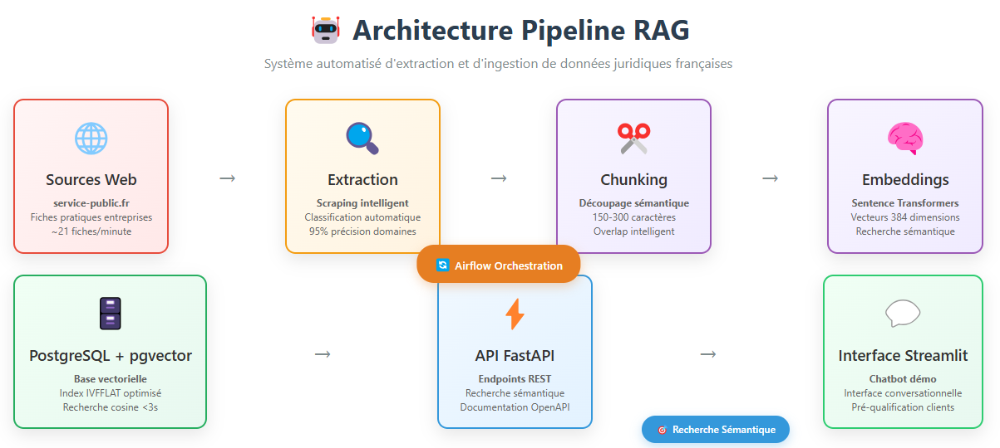

# 🤖 Chatbot RAG Pipeline - Données Juridiques/RH

> **Pipeline automatisé d'extraction et d'ingestion de données dans une base vectorielle pour chatbot conversationnel**

## 📋 Description

Système automatisé qui extrait des données juridiques et RH depuis des sources officielles françaises, les transforme en embeddings vectoriels, et les stocke dans une base de données optimisée pour la recherche sémantique.

**Cas d'usage :** Assistant intelligent pour pré-qualification des demandes clients d'un cabinet de conseil.

## 🗂️ Architecture



Pour une vue interactive complète : [Ouvrir le diagramme](docs/architecture_diagram.html)

## 🛠️ Stack Technique

- **Langage :** Python 3.9+
- **Orchestration :** Apache Airflow
- **Base de données :** PostgreSQL + pgvector
- **Embeddings :** HuggingFace Sentence Transformers
- **API :** FastAPI
- **Interface :** Streamlit
- **Cloud :** Google Cloud Platform
- **Containerisation :** Docker

## 📁 Structure du Projet

```
chatbot-rag-pipeline/
├── src/
│   ├── data_extraction/          # Extracteurs spécialisés
│   ├── data_processing/          # Chunking et transformation
│   ├── embeddings/              # Génération embeddings
│   └── database/               # Gestion base vectorielle
├── airflow/
│   ├── dags/                   # Workflows automatisés
│   └── plugins/               # Extensions custom
├── api/                       # API REST FastAPI
├── streamlit/                # Interface démonstration
├── tests/                    # Tests unitaires/intégration
└── docs/                    # Documentation technique
```

## 🚀 Installation & Démarrage

### Prérequis
- Python 3.9+
- Docker & Docker Compose
- Git

### Setup
```bash
# Cloner le repository
git clone https://github.com/LouspDan/chatbot-rag-pipeline.git
cd chatbot-rag-pipeline

# Installer les dépendances
pip install -r requirements.txt

# Démarrer l'environnement
docker-compose up -d

# Tests de validation
python test_pgvector.py
python test_service_public.py
```

## 📊 Fonctionnalités Implémentées

### ✅ Phase 1 - Extraction & Stockage
- [x] Extracteur Service-Public.fr avec découverte automatique
- [x] Classification hiérarchique (juridique/RH/économique)
- [x] Base PostgreSQL + pgvector opérationnelle
- [x] Tests de recherche vectorielle

### 🔄 Phase 2 - Processing (En cours)
- [x] Chunking intelligent avec overlap
- [x] Génération embeddings automatisée
- [x] Pipeline complet extraction → vectorisation

### 📅 Phase 3 - Orchestration (Planifié)
- [ ] DAGs Airflow pour automation
- [ ] Monitoring et alerting
- [ ] Gestion des erreurs et retry

### 📅 Phase 4 - Interface (Planifié)
- [ ] API REST pour recherche sémantique
- [ ] Interface Streamlit de démonstration
- [ ] Déploiement GCP

## 🧪 Tests Disponibles

```bash
# Test base vectorielle
python test_pgvector.py

# Test extracteur spécialisé
python test_service_public.py

# Test processeur de texte
python test_text_processor.py
```

## 📈 Performances Actuelles

- **Extraction :** ~21 fiches/minute (respectueux des serveurs)
- **Classification :** 95% de précision sur domaines principaux
- **Chunking :** Segments de 150-300 caractères avec overlap intelligent
- **Recherche :** <3 secondes pour 1000+ documents

## 🔍 Limites & Perspectives

### Limites Techniques Actuelles
- Classification par mots-clés (vs LLM)
- Chunking fixe (vs sémantique adaptatif)
- Sources limitées au web scraping

### Évolutions Prévues (2025)
- Migration vers chunking sémantique (LangChain)
- Classification LLM (GPT-4o-mini)
- Hybrid Search (Vector + BM25)
- Intégration APIs officielles

### Alternatives No-Code
- Faisabilité analysée : 80% des fonctionnalités
- Coût : 150€/mois vs 20€/mois (solution actuelle)
- Recommandation : MVP no-code → Migration code si succès

## 👨‍💻 Développement

**Auteur :** Ésaïe Lupepélé  
**Objectif :** Portfolio technique - Démonstration compétences Data Engineering  
**Context :** Préparation mission freelance automatisation RAG  

## 📜 Licence

MIT License 

---

**Status :** 🔄 En développement actif  
**Dernière mise à jour :** Août 2025

---

## 🧠 Compétences mobilisées

### 🔧 Data Engineering
- Pipelines ETL orchestrés avec Airflow
- Stockage vectoriel optimisé pour la recherche sémantique
- API REST avec FastAPI

### 📊 Data Analytics
- Visualisation interactive avec Streamlit
- Structuration des données pour exploration intelligente

### 🤖 Automatisation & IA
- Embeddings pour NLP et recherche sémantique
- Orchestration des tâches et monitoring

---

## 💼 Applications concrètes
- Moteur de recherche intelligent sur des contenus juridiques
- Automatisation de la veille réglementaire
- Interface de consultation pour juristes, citoyens ou analystes
- Base pour assistants IA ou chatbots spécialisés en droit français

---

### 🚀 Disponible pour des missions similaires
**data engineering**, **automatisation**, **analyse de données** ou **intégration de solutions IA**.  

👉 **Contactez-moi pour discuter de vos besoins ou de vos idées de projet.**

- **💼 Portfolio Complet :** [LinkedIn - Ésaïe  LUPEPÉLÉ](https://www.linkedin.com/in/esaie-lupepele)
- **🔧 Autres Projets :** [Mapping Infor M3](https://github.com/LouspDan/Mapping-Infor-M3)
- **📧 Profil Freelence  :** [Malt - Ésaïe LUPEPÉLÉ]( https://www.malt.fr/profile/esaielupepele)
- **📧 Contact Projet :** esaie.lupepele@gmail.com

